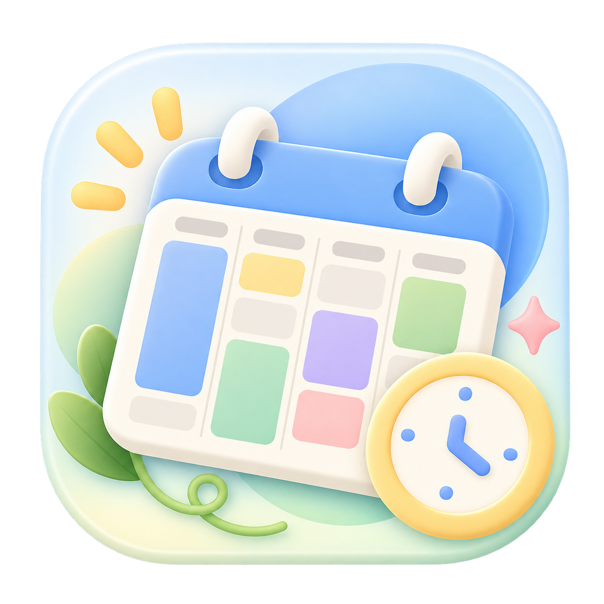

<div align="center">
  
  <h1>fkwakeup</h1>
  <p><strong>把课表截图，变成随手可查的课程表。</strong></p>
  <p>一款轻松、柔和的 Android 课程表 App，用你常用的 AI 识别课表，再由 App 导入、校对和管理课程。</p>
  <p>
    <a href="https://github.com/Leng-CS/fkwakeup/releases/latest"></a>
    
    <a href="LICENSE"></a>
  </p>
  <p><a href="https://github.com/Leng-CS/fkwakeup/releases/latest"><strong>下载最新版本 APK →</strong></a></p>
</div>

---

## 让课表整理轻松一点

把教务系统课表截图交给你熟悉的 AI，复制识别结果回到 App；核对课程和时间后，就能在周视图与桌面小组件中查看。你也可以跳过 AI，手动建立和管理课表。

| 功能 | 说明 |
|---|---|
| 📷 **AI 截图导入** | 复制提示词，把课表图片交给 ChatGPT、Claude、豆包、通义等 AI，再粘贴识别结果。可校对字段，也支持线下课、直播网课和异步网课。 |
| 🗓️ **周视图与课程管理** | 查看课程、周次、节次和教室；编辑多时间段课程、切换学期，并设置各节的上课时间。 |
| 🧩 **桌面小组件** | `4×1`、`4×2`、`4×4` 三种显示模式，列表可纵向浏览；每个组件都能单独设置课程范围、标记样式和背景。 |
| 🔔 **提醒与冲突检查** | 为课程设置提醒，也可为单次课程调整；保存时间重叠的课程前会提示冲突。 |
| 📦 **本地保存与备份** | 课表数据保存在设备本地，可导出备份并重新导入。无需注册账号，也不会登录或抓取教务系统。 |
| 🎨 **柔和的视觉风格** | 以轻松、柔和的色彩呈现日常课表，让查看安排更清爽。 |

## 从截图到课表

1. 在教务系统截取完整课表，尽量包含星期、节次，以及周视图之外的网课区域。
2. 在 App 导入页复制识别提示词，连同截图发给你常用的 AI。
3. 将 AI 返回的 JSON 整段粘贴回 App。
4. 在预览页核对课程、时间段和网课安排，补齐提示的字段后确认导入。

AI 只负责识别截图；课程数据由 App 在本地解析和保存。项目不提供云同步或教务系统自动登录。

## 下载与兼容性

前往 [GitHub Releases](https://github.com/Leng-CS/fkwakeup/releases/latest) 下载 APK 和对应的 SHA-256 校验文件。**Android 8.0（API 26）及以上**可安装。

## 开发

项目使用 Kotlin、Jetpack Compose、Material 3、Room、DataStore、kotlinx.serialization、Hilt、Glance 和 WorkManager。

在 Windows 上运行单元测试并构建调试 APK：

```powershell
.\gradlew.bat testDebugUnitTest :app:assembleDebug
```

APK 输出在 `app/build/outputs/apk/debug/app-debug.apk`。项目约定、数据模型与导入格式见[开发文档](docs/project-blueprint.md)。

## 项目文档

- [开发文档](docs/project-blueprint.md) · 功能需求、数据模型、导入格式与验收标准
- [识别提示词](docs/recognition-prompt.md) · App 内提示词和导入文案
- [导入格式示例](docs/timetable-sample.json) · `campus-timetable` JSON
- [项目交接说明](docs/HANDOFF.md) · 项目结构与工程注意事项
- [变更记录](docs/CHANGELOG.md) · 版本与迭代记录

## 许可

[Apache License 2.0](LICENSE)
